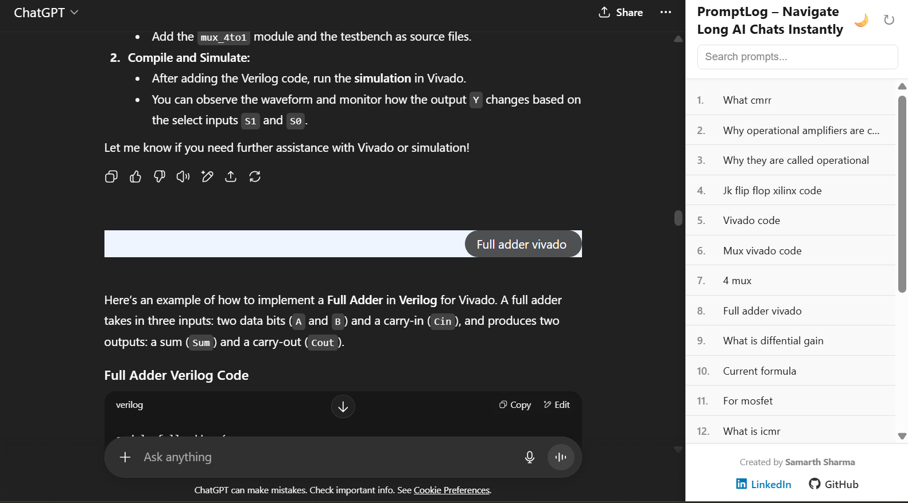
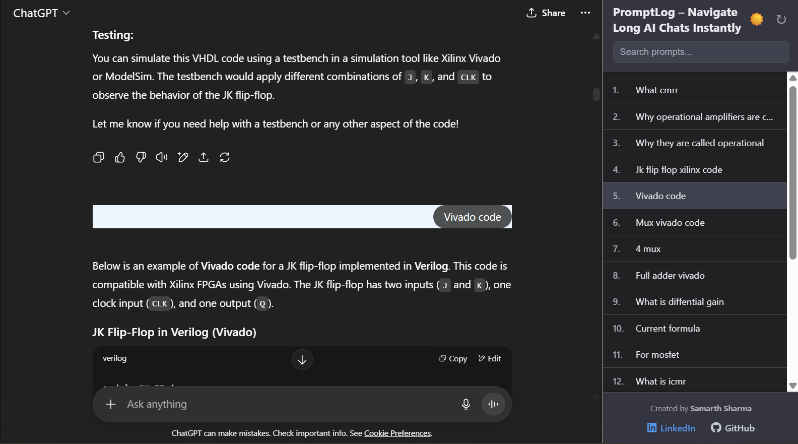
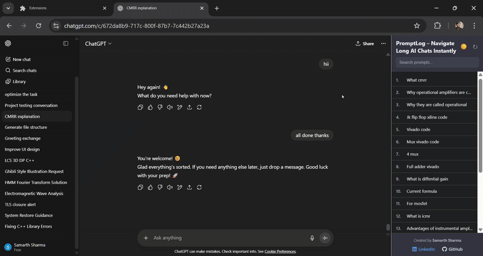

# PromptLog: ChatGPT Conversation Indexer

<p align="center">
  
  
  
</p>

PromptLog is a browser extension that supercharges your ChatGPT experience.
Long conversations can become difficult to navigate, making it hard to find a specific question you asked.
PromptLog solves this by adding a sleek, dockable sidebar that automatically indexes all of your prompts, allowing you to find and jump to any part of the conversation instantly.

---

## 📸 Screenshots

| Light Mode | Dark Mode |
|------------|-----------|
|  |  |

---

## 🎥 Demo Video




---

## ✨ Key Features

*   **Automatic Prompt Indexing** – Automatically scans the page and creates a numbered list of all your questions.
*   **Click-to-Scroll** – Instantly jump to any prompt in the conversation by clicking it in the sidebar.
*   **Seamless Docking** – Sidebar docks neatly without covering ChatGPT content.
*   **Live Search** – Quickly filter your prompts.
*   **Light & Dark Themes** – Matches ChatGPT UI; toggle persists.
*   **Collapsible Sidebar** – Hide or show instantly; remembers state *(coming soon)*.
*   **Cross-Browser Support** – Works on Google Chrome & Brave.

---

## 🚀 Installation

### Option 1: From the Official Store *(Coming Soon)*

*   **[Chrome Web Store](link-to-your-chrome-store-page)**
*   **[Brave Addons](link-to-your-brave-store-page)**

### Option 2: Manual Installation (Developers)

1.  **Clone the repository**
    ```bash
    git clone https://github.com/samarthzxy/PromptLog.git
    ```
2.  **Open Extensions Page**
    *   **Chrome:** `chrome://extensions`
    *   **Brave:** `brave://extensions`
3.  **Enable Developer Mode** (top-right toggle).
4.  **Load Unpacked**
5.  Select the cloned folder.
6.  The PromptLog icon should now appear in your toolbar.

---

## 📖 Usage

1.  Go to `chat.openai.com`.
2.  The sidebar automatically appears on the right.
3.  **Features:**
    *   Click items to scroll.
    *   Use the search bar to filter.
    *   🌙/☀️ toggle for dark/light.
    *   ▶️ to collapse the sidebar.

---

## 📂 Project Structure
```
.
├── assets/
│ ├── icon128.png
│ ├── sidebar-dark.png
| ├── sidebar-light.png
| ├── demo.gif
├── content.js
├── sidebar.html
├── sidebar.js
├──sidebar.css
├── manifest.json

```
*   `manifest.json`: Defines the extension's permissions, icons, and content scripts.
*   `content.js`: This is the main script that runs on the ChatGPT page. Its job is to:
    *   Detect when a conversation is present using a `MutationObserver`.
    *   Inject the `sidebar.html` into the page as an `<iframe>`.
    *   Extract user prompts and send them to the sidebar for indexing.
    *   Handle the logic for docking, collapsing, and expanding the sidebar.
    *   Listen for messages from the sidebar (like `SCROLL_TO_MESSAGE`) and interact with the main page.
*   `sidebar.html`: A self-contained HTML file that provides the structure for the sidebar's user interface, including the header, search bar, message list, and footer. It also contains all the CSS for theming.
*   `sidebar.js`: This script runs inside the sidebar's `<iframe>`. Its job is to:
    *   Listen for messages from `content.js` containing the prompts to be indexed.
    *   Dynamically create the list of indexed items.
    *   Handle all user interactions within the sidebar: searching, toggling themes, refreshing, and collapsing.
    *   Send messages back to `content.js` when an action needs to affect the main page (e.g., when a user clicks an indexed item).

## 🤝 Contributing

Contributions are welcome! If you have an idea for a new feature or have found a bug, please feel free to open an issue or submit a pull request.

1.  **Fork** the repository.
2.  Create a new branch: `git checkout -b feature/my-awesome-feature`.
3.  Make your changes and **commit** them: `git commit -m 'Add some awesome feature'`.
4.  **Push** to the branch: `git push origin feature/my-awesome-feature`.
5.  Open a **Pull Request**.

## 📄 License

This project is licensed under the MIT License. See the [LICENSE](LICENSE) file for details.

---

### Created By
 // Yashvardhan Agarwal
